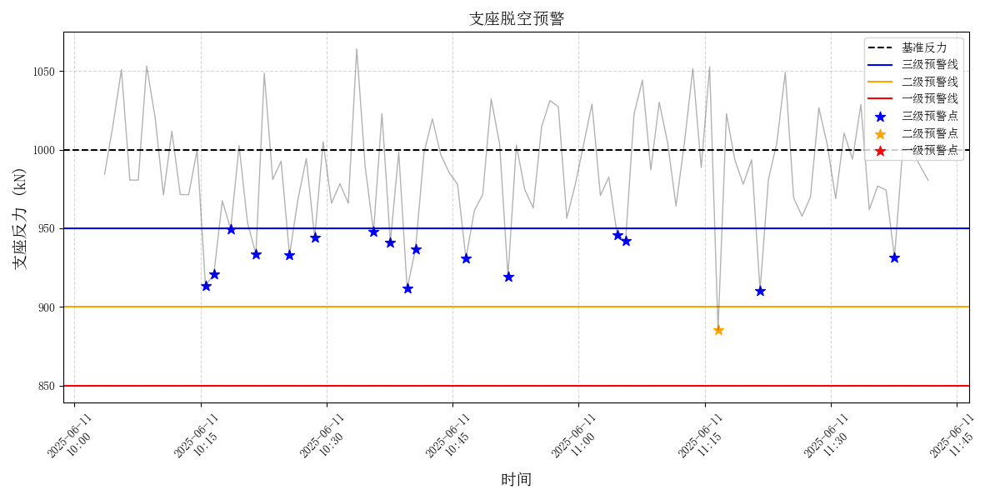

# ⚙️ 支座脱空预警模型

> 城市生命线安全工程 | 支座反力监测 | 设定阈值判别 | 分级异常识别与可视化

------

## 📚 项目背景

支座是桥梁结构中连接上部结构与下部墩台的关键构件，承担着传递荷载与适应位移的作用。在长期服役过程中，由于施工质量缺陷、材料老化、桥面不均匀沉降或温度效应等影响，支座可能发生**脱空、偏压或失效**等病害，导致结构传力路径异常，严重时将引起主梁局部应力集中、裂缝甚至跨中坍塌等重大隐患。

支座反力的长期监测可用于辅助判断支座是否存在异常失效迹象。本模块基于实际支座反力相对基准反力的下降幅度，通过设定多级阈值判断支座是否发生脱空或异常载荷传递，并提供**自动识别、分级预警与可视化能力**，适用于桥梁结构健康监测系统的集成部署。

------

## 📌 模型简介

该模块为 **城市生命线安全工程监测平台桥梁预警体系核心子模块Ⅶ：支座脱空预警模型**，通过对**支座反力数据的动态识别与报警判别**，辅助识别结构受力异常、支座失效等潜在问题。

- **模块名称**：`bearing_alert`
- **模型名称**：支座脱空预警模型
- **作者**：肖图刚
- **开发时间**：2025年6月12日
- **最后修改**：2025年6月12日

------

## 🌟 功能描述

✅ 加载包含时间戳与支座反力的时程数据（CSV 格式）
 ✅ 绘制支座反力变化曲线，自动叠加设计反力线及多级预警阈值
 ✅ 支持灵活配置各级报警阈值（基于设计反力）
 ✅ 自动识别一级、二级、三级异常点并打印统计结果
 ✅ 提供批量分析能力和可视化输出结果
 ✅ 支持部署至结构健康监测系统，用于桥梁支座状态在线评估

------

## 📂 输入数据说明

- **格式**：本地 CSV 文件，默认含表头，第一列为时间戳，第二列为支座反力（单位 kN）
- **字段结构示例**：

| timestamp           | reaction (kN) |
| ------------------- | ------------- |
| 2025-06-01 00:00:00 | 1032.4        |
| 2025-06-01 01:00:00 | 998.2         |
| ...                 | ...           |


- **数据来源**：桥梁支座监测传感器（如压力传感器、称重垫片等）
- **采样频率**：1小时或日均值等，建议时间一致性处理后分析
- **特别说明**：如存在多个支座，请拆分为单列数据分别建模或批量处理；当前数据为模拟数据，后续需更换成实际监测数据

------

## ⚙️ 运行环境与依赖

- **Python**：≥ 3.9.16
- **依赖库**：
  - pandas ≥ 2.2.3
  - numpy ≥ 1.26.4
  - matplotlib ≥ 3.9.4
  - tabulate ≥ 0.9.0

> 📝 **使用建议**
>
> - 支座基准反力应根据桥梁监测系统前期的稳定支座反力数据进行录入；
> - 各级报警阈值建议结合经验数据或试验研究成果进行设定；
> - 建议定期校准传感器零点，避免长期漂移影响误判。

------

## 🛠️ 快速使用说明

📁 安装依赖：

```bash
pip install -r requirements.txt
```

📁 安装模块：

```bash
cd py_modu/bearing_alert
pip install -e .
```

✅ 安装成功：

```nginx
Successfully installed bearing_alert-0.1.0
```

⚙️ 运行示例(example.py)：

```
from bearing_alert import analyze_bearing_data, print_alert_statistics, visualize_alerts

def main():
    input_file = 'datasets/bearing_data.csv'
    base_force = 1000  # kN
    thresholds = {
        'normal': 0.05,
        'level3': 0.10,
        'level2': 0.15
    }

    df = analyze_bearing_data(input_file, base_force, thresholds)
    print_alert_statistics(df)
    visualize_alerts(df, base_force, thresholds)

if __name__ == '__main__':
    main()

```

------

## 💾 输出结果说明

- **核心输出**：
  - `bearing_alert_output.csv`：包含各时间点支座反力数值、设定基准值、各级预警判断结果
  - `bearing_alert_plot.png`：支座反力时序变化趋势图，标注各级预警阈值线与异常点
  - 控制台打印输出 **各级预警统计信息表格**，便于技术人员快速定位异常时段和幅度
- **输出字段说明（CSV 文件）**：

| timestamp        | bearing_force (kN) | level_3 | level_2 | level_1 |
| ---------------- | ------------------ | ------- | ------- | ------- |
| 2025-06-11 10:15 | 913.47             | True    | False   | False   |
| 2025-06-11 11:16 | 885.21             | False   | True    | False   |

- **控制台输出样例**：

```yaml
===== 各级预警统计信息 =====

【三级预警】 (数量: 16)
+------------------+-------------------+
|      时间点      |   支座反力 (kN)   |
+------------------+-------------------+
| 2025-06-11 10:15 | 913.468790213688  |
| 2025-06-11 10:16 | 921.0032866994788 |
| 2025-06-11 10:18 | 949.4867551866232 |
| 2025-06-11 10:21 | 933.5078519465884 |
| 2025-06-11 10:25 | 933.0100725514616 |
| 2025-06-11 10:28 | 943.9602569031078 |
| 2025-06-11 10:35 | 947.691562841764  |
| 2025-06-11 10:37 | 941.1662540011592 |
| 2025-06-11 10:39 | 911.613195044809  |
| 2025-06-11 10:40 | 936.8725580440628 |
| 2025-06-11 10:46 | 930.859120385303  |
| 2025-06-11 10:51 | 919.4783937854908 |
| 2025-06-11 11:04 | 945.7466010397588 |
| 2025-06-11 11:05 | 942.1517350367732 |
| 2025-06-11 11:21 | 910.4972434159642 |
| 2025-06-11 11:37 | 931.4594020747152 |
+------------------+-------------------+

【二级预警】 (数量: 1)
+------------------+-------------------+
|      时间点      |   支座反力 (kN)   |
+------------------+-------------------+
| 2025-06-11 11:16 | 885.2101958364102 |
+------------------+-------------------+
```

- **图像示例**：



🔎 **说明**：

- 本模块当前以 **支座反力偏离设计值的程度** 实现分级预警，阈值可灵活设定，适用于突变型和渐变型结构异常识别场景。当前模型支持单点监测，后续可扩展多点联合诊断与趋势分析功能。
- ⚠️ 当前使用的数据为 **模拟生成数据**，用于算法验证与功能测试；**实际部署时需替换为结构监测系统采集的真实支座反力数据**，格式需包含时间戳与支座反力（单位：kN），并确保采样时间间隔一致、数据连续性良好。

------

## 🔁 后续优化建议

1. 输入数据替换为结构监测系统采集的真实支座反力数据；
2. 增加对多支座/多桥梁批量处理功能；
3. 融合环境温度或荷载变化，构建多元回归残差分析模型；
4. 引入机器学习异常检测算法（如 Isolation Forest、LOF）提升识别能力；
5. 对接实时数据库，支持监控平台图形化展示与报警推送。
